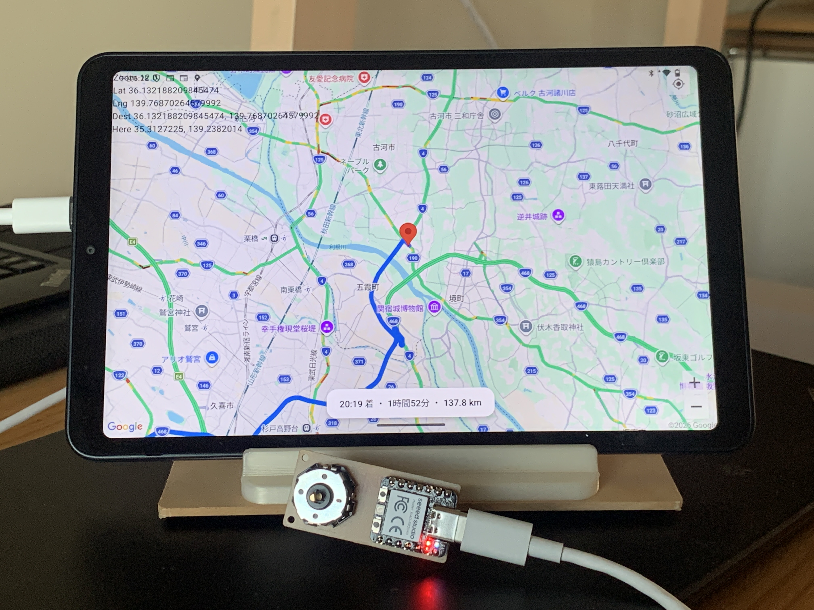
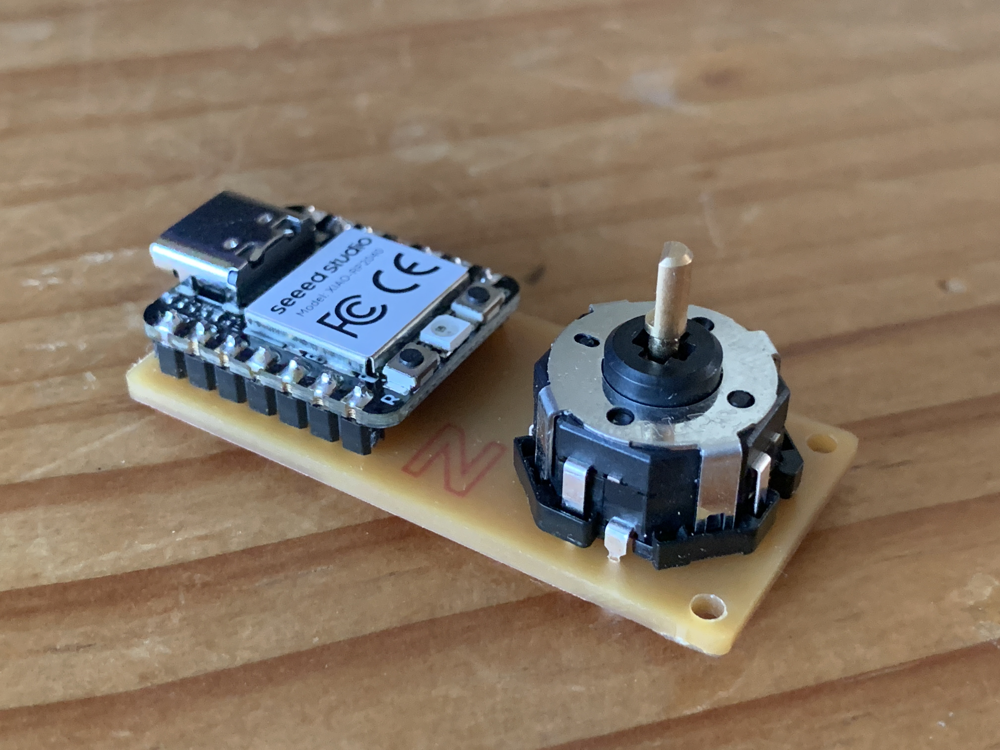
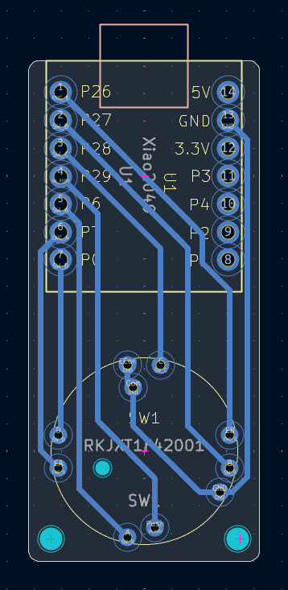
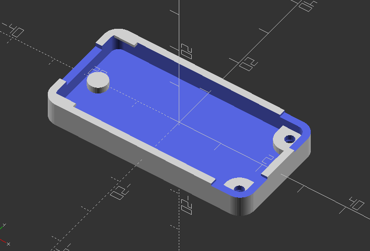
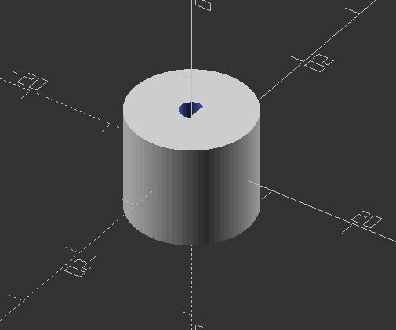

# map-controllor

車載向けの地図ナビ Android アプリと、それを操作するハードウェア一式です。
USB 接続のコントローラーからキー入力を送り、アプリ側で地図のスクロール・ズーム・目的地設定などを行います。

## リポジトリ構成

| ディレクトリ | 内容 |
| --- | --- |
| [`android/`](android/) | Google Maps ベースのナビ Android アプリ |
| [`firmware/`](firmware/) | QMK ファームウェア（HID キーボード） |
| [`pcb/`](pcb/) | KiCad 基板データ |
| [`enclosure/`](enclosure/) | ケース・エンコーダノブ（OpenSCAD） |

## Android アプリ

[Maps SDK for Android](https://developers.google.com/maps/documentation/android-sdk) を使った、キーボード操作対応の Android アプリです。
車載してナビとして使うことを想定しており、本 README では **ナビアプリ** と呼びます。

セットアップ・ビルド手順は [`android/README.md`](android/README.md) を参照してください。

## ハードウェア

ナビアプリを操作する物理コントローラーです。次の部品を載せた基板で構成します。

| 部品 | 説明 |
| --- | --- |
| [Alps RKJXT1F42001](https://tech.alpsalpine.com/j/products/detail/RKJXT1F42001/) | 4 方向スイッチ + プッシュ + ロータリーエンコーダ |
| [Seeed XIAO RP2040](https://wiki.seeedstudio.com/ja/XIAO-RP2040/) | USB 接続のマイコン（QMK ファームウェアを書き込む） |

基板データは [`pcb/`](pcb/) にあります。
基板の製造制約・配線ルール・回路設計の詳細は [`pcb/AGENTS.md`](pcb/AGENTS.md) を参照してください。

## ファームウェア

[QMK](https://qmk.fm) でビルドする HID キーボード用のソースコードです。ここでいう **ファームウェア** は、工場出荷時に XIAO RP2040 に最初から入っているソフトではありません。利用者が自分でコンパイルして `.uf2` ファイルを生成し、USB 接続したハードウェアへ書き込むものです。

このファームウエアを書き込んだ後は、コントローラーの入力は USBで接続したデバイス（ここではナビアプリをインストールしたAndroid 端末を想定）に送られます。ビルド・書き込み手順、キー割り当ては [`firmware/README.md`](firmware/README.md) を参照してください。

## ケース

基板と部品を収める 3D プリント用ケースです。[`enclosure/`](enclosure/) に OpenSCAD ソースと STL があります。

| ファイル | 内容 |
| --- | --- |
| [`case.scad`](enclosure/case.scad) | 下ケース（基板 cavity・USB 切り欠き・ネジピラー） |
| [`knob.scad`](enclosure/knob.scad) | RKJXT1F42001 用エンコーダノブ |
| [`case.stl`](enclosure/case.stl) | 下ケース（出力済み STL） |
| [`knob.stl`](enclosure/knob.stl) | ノブ（出力済み STL） |

### 寸法・設計

基板 [`pcb/encoder.kicad_pcb`](pcb/encoder.kicad_pcb) の外形（21 × 45.5 mm、板厚 1.6 mm、角 R1 mm）に合わせています。

| 項目 | 値 |
| --- | --- |
| 基板サイズ | 21 × 45.5 mm |
| 取付穴 | (2, 2)、(19.25, 2) mm、φ2 mm |
| エンコーダ（SW1）中心 | 基板下辺から 10 mm |
| ノブ外径 | 14 mm |
| シャフト穴 | Ø2.5 mm（D カット、RKJXT1F42001 内側シャフト） |

下ケースは XIAO RP2040 下に中央支柱を 1 本置き、ピンヘッダとの干渉を避けています。USB-C コネクタ用の切り欠きは基板上辺側にあります。

### 組み立て

1. 下ケースに基板を載せ、取付穴位置 `(2, 2)` / `(19.25, 2)` から **M2 ネジ**を下側から通す
2. 基板上面に **M2 ナット**を載せて固定する
3. [`knob.scad`](enclosure/knob.scad) で出力したノブをエンコーダシャフトに取り付ける

### STL の再出力

[OpenSCAD](https://openscad.org/) で各 `.scad` を開き、**F6**（レンダリング）→ **F7**（STL 出力）で `case.stl` / `knob.stl` を生成できます。ノブのシャフト穴が合わない場合は `knob.scad` の `shaft_d` を微調整してください。
